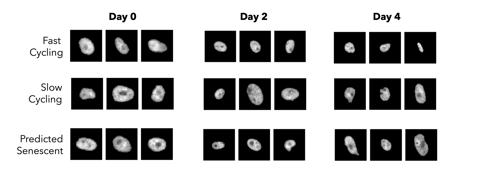

#  Cell Fate Prediction with Deep Learning

## About
This project applys multiple deep learning models to predict a cell-cycling status (CDK2 activity) of Palbociclib-treated cells from time-series nuclear morphology data. All data used in this project is from [Spencer Lab](https://www.colorado.edu/lab/spencerlab/) and may not be used without permission.
### Multi-layer Perceptron classifier ([NN.ipynb](https://github.com/FahsaiNak/DLPredSen/blob/main/NN.ipynb))
The model uses 26 morphological features extracted by RegionProp package from Matlab. The input features are stored in the table along with their labels. Accuracy: 70.21%
### Convolutional neural networks ([CNN.ipynb](https://github.com/FahsaiNak/DLPredSen/blob/main/CNN.ipynb))
The model trains with nuclear morphological images of cells that classified for fast cycling, slow cycling and predicted senescent by CDK2 activity. Accuracy: 60.99%
### Ensemble Models ([CNN+NN.ipynb](https://github.com/FahsaiNak/DLPredSen/blob/main/CNN.ipynb))
The model uses both image and numerical features to classify the cells. Accuracy: 65.94%
### Recurrent Neural Networks ([RNN.ipynb](https://github.com/FahsaiNak/DLPredSen/blob/main/RNN.ipynb))
The model trains with a time series of morphological features (10 frames distributed between Day 0 to Day 1). Accuracy: 77.01%

